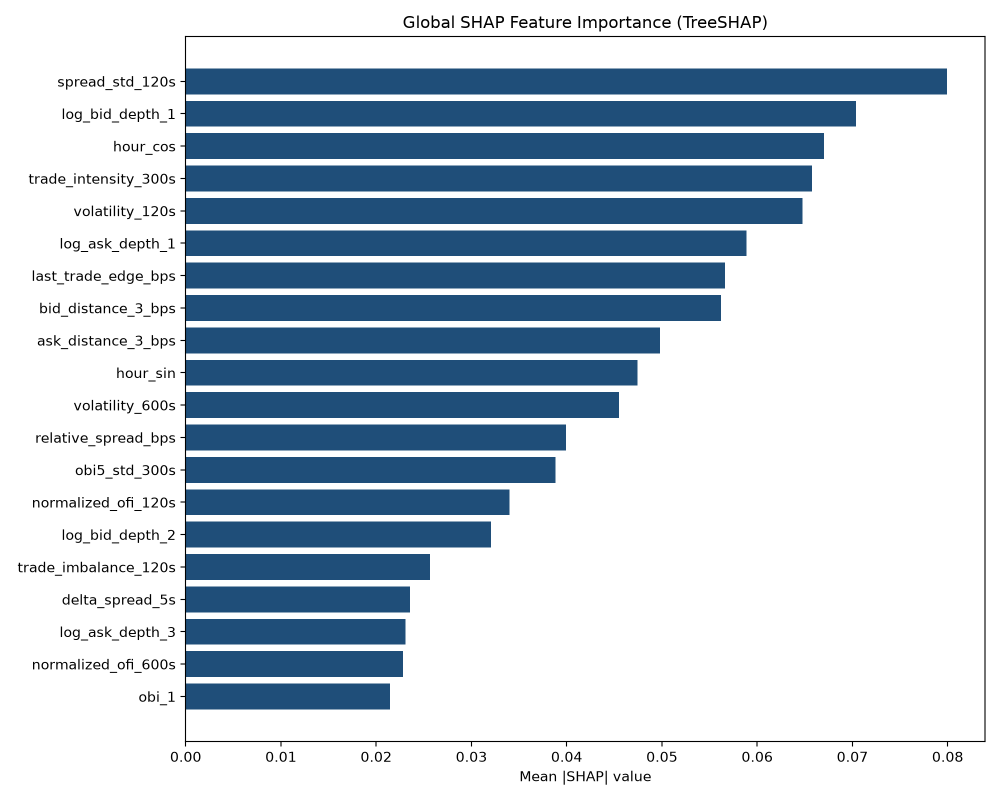
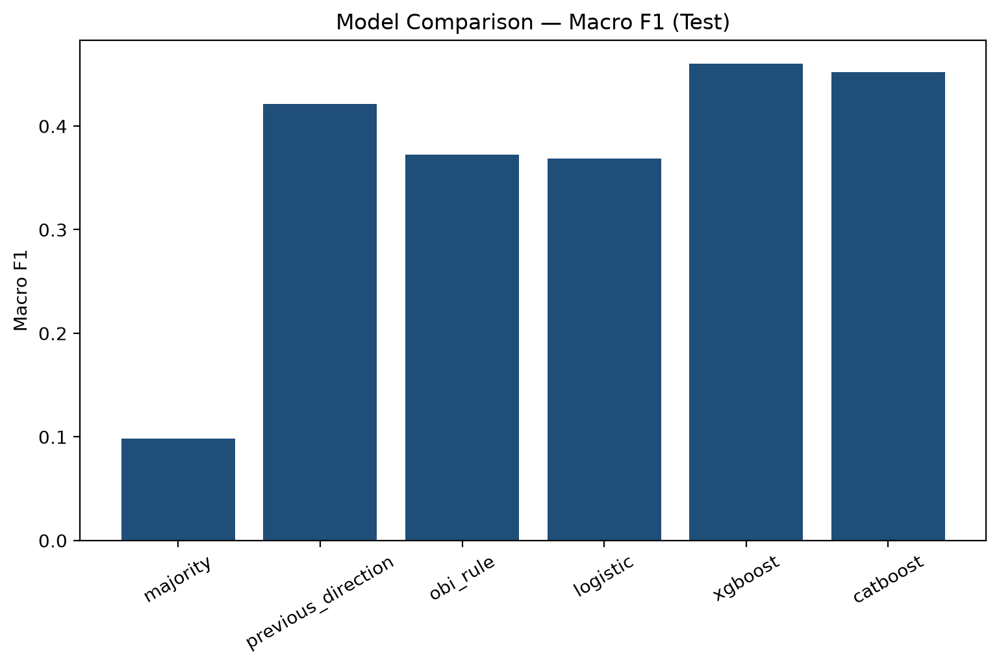
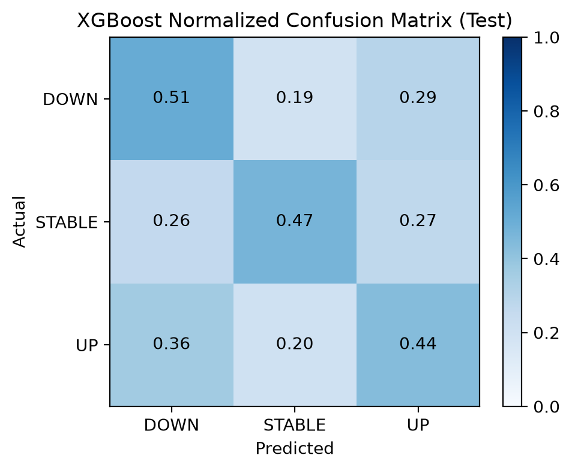
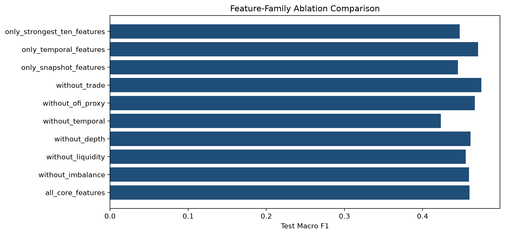
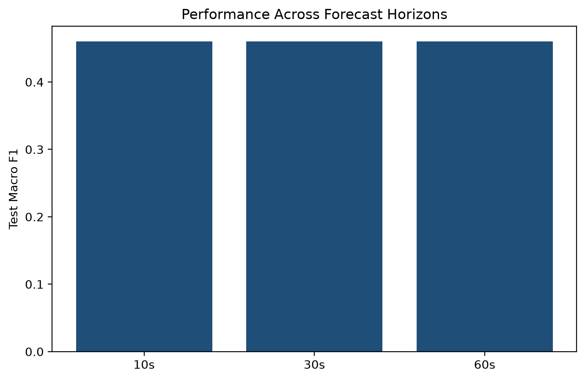

# Explainable Machine Learning for Short-Term Bitcoin Price Movement Prediction Using Nobitex Limit Order Book Data

## 1. Abstract

This repository implements a reproducible research pipeline that predicts short-term **BTCIRT** mid-price direction from Nobitex Limit Order Book snapshots using CPU-friendly gradient boosting (XGBoost) and TreeSHAP explainability. The task is three-class classification (`DOWN`, `STABLE`, `UP`) at a primary 30-second horizon, with robustness checks at 10 and 60 seconds.

## 2. Research Questions

1. Can LOB information predict short-term BTCIRT mid-price direction?
2. Which microstructure variables matter most for UP, DOWN, and STABLE moves?
3. Are model explanations stable across time, liquidity, and volatility regimes?
4. How much predictive value do imbalance, liquidity, temporal, OFI-proxy, and trade features add?

## 3. Motivation

Short-horizon crypto prices respond to visible book imbalance, liquidity, and order-flow pressure. Transparent tree models plus SHAP allow economically readable attributions without GPU-heavy deep LOB architectures.

## 4. Dataset Description

- Source file: `data/raw/market_data_clean_nobitex.csv` (**not committed**)
- Filter: `exchange == nobitex`, `symbol == BTCIRT` (normalized)
- Multi-market raw CSV; only BTCIRT retained

### Important caveats
- Data are **snapshots**, not a complete order-event stream.
- **OFI is a snapshot-based proxy**, not true event OFI.
- Analysis is specific to **BTCIRT on Nobitex** and may not generalize.
- **SHAP is not causal**.
- **Prediction ≠ trading profitability**.

## 5. Data Schema

Expected columns include identifiers (`id`, `timestamp`, `exchange`, `symbol`), flattened LOB levels 1–8 (`asks_price_*`, `asks_qty_*`, `bids_price_*`, `bids_qty_*`), and `last_trade_price` / `last_trade_qty`. JSON-like columns (`data`, `asks`, `bids`, `last_trade`) are unused when flattened fields are complete.

## 6. Data-Quality Summary

See `reports/metrics/data_quality.json` and `reports/tables/data_quality_summary.csv` after running the pipeline. Gaps, crossed books, and unsorted levels are counted explicitly—not silently ignored.

## 7. Target Definition

Future mid-price near \(t+h\) (median in a smoothing window, with tolerance fallback under sparse sampling). Future log-return in bps; classes via training-only epsilon targeting ~35% STABLE.

## 8. Feature Engineering

Economically motivated stationary features:

| Feature family | Examples | Meaning |
|----------------|----------|---------|
| Liquidity | `relative_spread_bps` | Cost of immediacy / thinness |
| Depth | `log_*_depth_k` | Displayed size near touch |
| Imbalance | `obi_k`, `weighted_obi` | Bid vs ask pressure |
| Microprice | `microprice_edge_bps` | Size-weighted fair-price displacement |
| Order flow | `ofi_proxy_*`, `normalized_ofi_*` | Snapshot OFI proxy |
| Dynamics | `return_*s`, `delta_*` | Recent mid/imbalance changes |
| Volatility | `volatility_*s` | Realized short-horizon risk |
| Trade | `trade_imbalance_*`, `time_since_last_trade` | Optional last-trade activity |
| Time | `hour_sin/cos` | Intraday seasonality |

## 9. Model Methodology

- Baselines: majority, previous direction, OBI rule, multinomial logistic regression
- Primary: XGBoost (`multi:softprob`, `tree_method=hist`)
- Challenger: CatBoost
- No neural nets / GPU methods in this version

## 10. Temporal Validation

Chronological **date** split 60/20/20 + purge gap. Walk-forward folds inside train+val. Test set frozen until final evaluation. Metrics on full and non-overlapping test subsets.

## 11. Evaluation Metrics

Primary: **Macro F1**. Also: balanced accuracy, per-class PR/F1, log loss, MCC, Brier, OvR ROC-AUC, confusion matrices, day-bootstrap CIs when feasible.

## 12. Financial Feature Meanings

- **Spread**: difference between best ask and bid; relative spread in bps normalizes by mid.
- **Depth**: cumulative displayed size; log depth stabilizes heavy tails.
- **OBI**: normalized bid−ask depth; positive values indicate buy-side dominance.
- **Weighted OBI**: exponentially emphasizes near-touch levels.
- **Microprice**: size-weighted combination of best quotes; edge vs mid is a short-horizon signal.
- **OFI proxy**: Cont-style best-level contribution from consecutive **snapshots**.
- **Volatility**: sqrt of summed squared snapshot log-returns over a time window.

## 13. Experimental Results

Results below are produced by executing the pipeline (seed=42).

### Data retained
- Total raw rows: **835000**
- BTCIRT rows: **39693** (4.7537%)
- Date range: `2026-01-04 07:32:39.311165+00:00` → `2026-02-18 04:04:18.733462+00:00`
- Unique dates: **44**
- Engineered features: **74**
- Epsilon 10s / 30s / 60s (bps): **0.0022367135831138554** / **0.0022367135831138554** / **0.0022407210071395613**

### Best model: XGBoost
- Best hyperparameters: `{'max_depth': 5, 'learning_rate': 0.08808528201926892, 'n_estimators': 800, 'min_child_weight': 20.0, 'subsample': 0.7951416678468146, 'colsample_bytree': 0.981159758027898, 'reg_alpha': 1.454589190700593, 'reg_lambda': 10.786085455402576, 'gamma': 0.5119301811352055}`
- Validation Macro F1: **0.4644**
- Test Macro F1: **0.4599**
- Test Balanced Accuracy: **0.4728**
- Test Log Loss: **1.0186**
- Non-overlapping Test Macro F1: **0.4599**

### Top SHAP features
| Feature | Mean |SHAP| |
|---------|-------------|
| `spread_std_120s` | 0.079921 |
| `log_bid_depth_1` | 0.070397 |
| `hour_cos` | 0.067033 |
| `trade_intensity_300s` | 0.065750 |
| `volatility_120s` | 0.064738 |
| `log_ask_depth_1` | 0.058872 |
| `last_trade_edge_bps` | 0.056608 |
| `bid_distance_3_bps` | 0.056188 |








## 14. SHAP Explainability Findings

See `reports/final_report.md` and `reports/tables/shap_*.csv`. Explanations describe model behavior, not causality.

## 15. Feature Ablation Findings

See `reports/tables/ablation_results.csv` and `reports/figures/ablation_comparison.png`.

## 16. Horizon Robustness Findings

See `reports/tables/horizon_comparison.csv`.

## 17. Main Figures

Generated under `reports/figures/` (EDA, metrics, SHAP, ablation, horizons).

## 18. Interpretation of Results

Interpret Macro F1 relative to majority/OBI baselines. Inspect whether gains survive non-overlapping evaluation and whether SHAP-important families also hurt performance when ablated.

## 19. Limitations

Snapshot sparsity, market specificity, non-causal SHAP, and cost-unaware classification objectives.

## 20. Ethical and Financial Disclaimer

This project is for research and education only. It is **not** investment advice. Cryptocurrency trading involves substantial risk of loss. Do not deploy without independent validation, compliance review, and realistic transaction-cost modeling.

## 21. Reproduction Instructions

```bash
cd explainable-btcirt-lob
python -m venv .venv
source .venv/bin/activate
pip install -r requirements.txt
# Place market_data_clean_nobitex.csv in data/raw/
make all
# or:
python -m src.pipeline --config configs/project_config.yaml
pytest -q
```

## 22. Project Structure

See repository tree under `src/`, `notebooks/`, `configs/`, `reports/`, and `tests/`.

## 23. Future Work

Event-level reconstruction, multi-venue studies, and decision-focused evaluation under fees.

## 24. Citation

```bibtex
@software{explainable_btcirt_lob,
  title  = {Explainable ML for Short-Term BTCIRT LOB Prediction},
  year   = {2026},
  note   = {Nobitex BTCIRT snapshot study}
}
```
